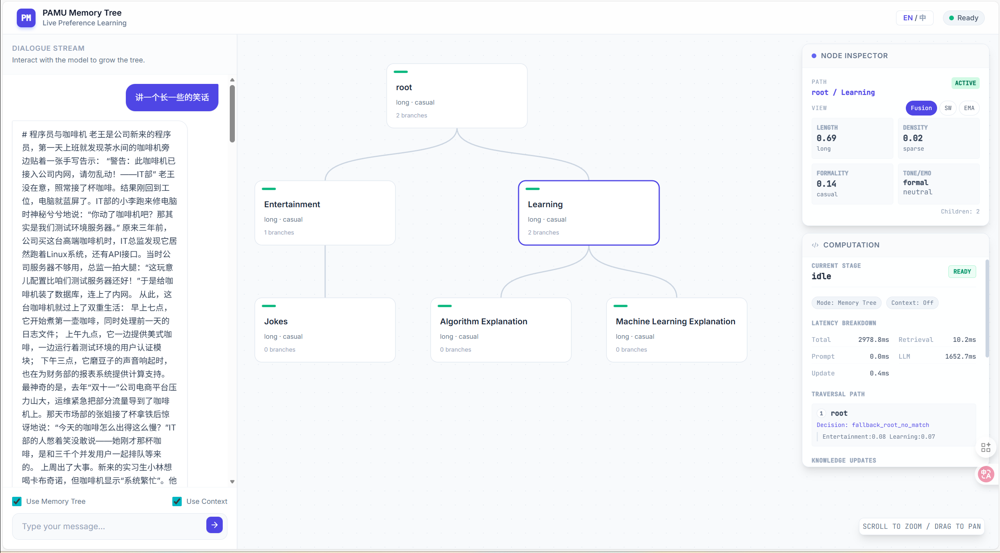

[English](README.md) | **中文**
# PAMT 偏好感知记忆树
项目名：**PAMT（偏好感知记忆树）**。Python 包名为 `pamt`。

一个可运行的偏好感知个性化系统，结合记忆树与 SW/EMA 融合更新，自动注入偏好控制提示词。

---

## 亮点

- 论文一致的偏好抽取（RoBERTa + SKEP + OpenNRE + 正式度模型）
- SW/EMA 融合 + 变化检测
- 三层记忆树（root -> category -> leaf）
- 可嵌入任何外部 agent 的 memory plugin
- JSON 持久化（自动 load/create，自动保存）

---

## 目录

- [快速开始](#快速开始)
- [外部插件（Memory Plugin）](#外部插件memory-plugin)
- [系统设计](#系统设计)
- [端到端流程](#端到端流程)
- [配置](#配置)
- [项目结构](#项目结构)

---

## 快速开始

### CLI Chatbot（DeepSeek + HF Embedding）

```bash
python example/chatbot/chatbot.py \
  --llm-model deepseek-chat \
  --deepseek-key YOUR_API_KEY \
  --embed-model sentence-transformers/paraphrase-multilingual-MiniLM-L12-v2 \
  --memory-file data/pamt_memory.json
```

---

## 外部插件（Memory Plugin）

插件提供两个核心能力：
- `augment(query)` -> 返回带偏好控制的 prompt
- `update(query, response)` -> 写回记忆树

```python
from pamt import create_memory_plugin, ModelConfig, EmbeddingConfig

plugin = create_memory_plugin(
    model_config=ModelConfig(model_name="deepseek-chat", api_key="YOUR_API_KEY"),
    embedding_config=EmbeddingConfig(model_name="sentence-transformers/paraphrase-multilingual-MiniLM-L12-v2"),
    storage_path="data/pamt_memory.json",
)

aug = plugin.augment("帮我写封邮件")
prompt = aug.prompt

# 交给任意 agent / LLM
response = "..."
plugin.update("帮我写封邮件", response)
```

---

## 系统设计

### 1) 偏好抽取
维度：
- 语气
- 情绪
- 长度
- 信息密度
- 正式度

论文模型：
- RoBERTa 编码器 + 多分类头（语气）
- SKEP（情绪）
- OpenNRE（三元组密度）
- 正式度分类模型

长度优先使用模型 token 数，否则使用词数。

### 2) SW/EMA 融合 + 变化检测

连续维度：
- `SW_t(d) = mean(p_{t-W+1:t}(d))`
- `EMA_t(d) = alpha * EMA_{t-1}(d) + (1-alpha) * p_t(d)`
- `w_t(d) = lambda * SW_t(d) + (1-lambda) * EMA_t(d)`

类别维度对概率向量执行 SW/EMA。

变化检测：
- `Delta_t(d) = |SW_t(d) - EMA_t(d)|`
- `C_t(d) = Delta_t(d) / (epsilon + Var(SW) + Var(EMA))`
- 当 `C_t(d) > threshold` 触发变化

### 3) 记忆树

结构：
- root -> category -> leaf

路由：
- Strict 匹配 -> 下降
- Loose 匹配 -> 候选合并
- 否则 fallback

叶子管理：
- 标签由 **query + response** 推断
- 叶子复用基于 **内容 embedding**
- 超过叶子上限时合并
- 必要时由 LLM 生成更粗粒度 label

更新权重：
- Leaf: 1.0
- Category: `1 / category_leaf_count`
- Root: `1 / total_leaf_count`

### 4) Prompt 注入
若存在偏好，则在用户输入前注入控制提示；否则直接使用原始输入。

### 5) 持久化
树结构 + 偏好状态保存为 JSON。插件自动 load-or-create，更新后自动保存。

---

## 端到端流程

1) 用户 query 进入
2) 记忆检索（短 query 可能使用上下文）
3) 拼接偏好控制 prompt
4) LLM 生成回复
5) 抽取偏好信号
6) 路由 + 更新记忆树
7) 保存到磁盘

---

## 配置

关键参数：
- `pamt/config.py`：窗口大小、EMA 衰减、融合权重、变化阈值、prompt 分箱
- `RetrievalConfig`：strict/loose 相似度、叶子数量、合并/复用阈值

---

## 项目结构

```
pamt/
  core/                 # prompting, memory tree, update logic
  extractors/           # preference extraction
  embeddings/           # HF embeddings
  llms/                 # DeepSeek LLM client
  memory_plugin.py      # external plugin wrapper
example/
  chatbot/              # CLI 示例
prompts/
  category_leaf.txt     # 标签推断
  leaf_only.txt
  leaf_merge_summary.txt
```


